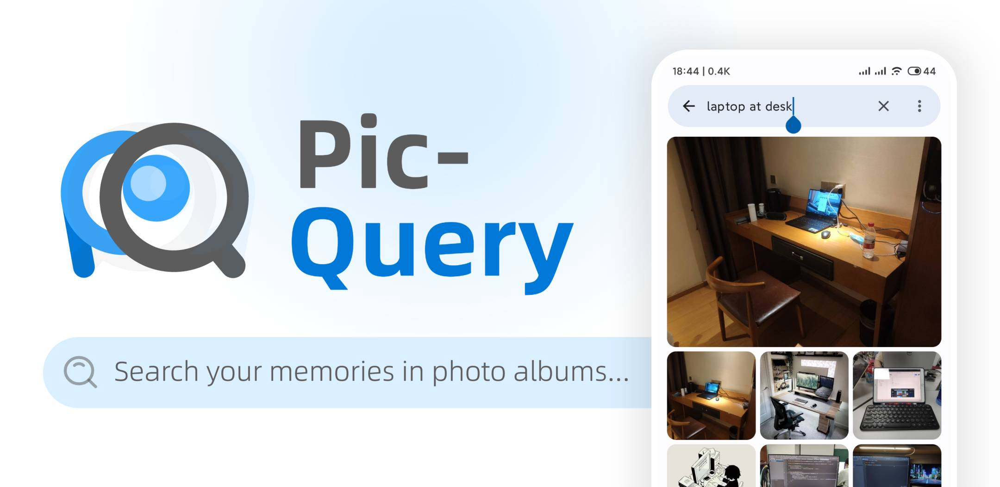

# PicQuery

[中文](README_zh.md)| English

🔍 Search for your local images with natural language, running completely offline. For example, "a laptop on the desk", "sunset by the sea", "kitty in the grass", and so on.

- Totally free, NO in-app purchases
- Support both English and Chinese
- Indexing and searching of images works completely offline without worrying about privacy
- Show results in less than 1 second when searching for 8,000+ photos
- Wait for indexing on the first time you launch, and search immediately afterward

## Installation

- Google Play - Search for “PicQuery”
- Download APK from [Release](https://github.com/greyovo/PicQuery/releases)
- If you have trouble accessing the above resources, please see [here](README_zh.md##其他方式)

> 🍎 For iOS users, please refer to _[Queryable](https://apps.apple.com/us/app/queryable-find-photo-by-text/id1661598353)_ ([Code](https://github.com/mazzzystar/Queryable)), the inspiration behind this application, developed by [@mazzzystar](https://github.com/mazzzystar/Queryable).

## Implementation

> Thanks to [@mazzzystar](https://github.com/mazzzystar) and [@Young-Flash](https://github.com/Young-Flash) for their assistance during the development. The discussion can be viewed [here](https://github.com/mazzzystar/Queryable/issues/12).

_PicQuery_ is powered by OpenAI's [CLIP model](https://github.com/openai/CLIP).

First, the images to be searched are encoded into vectors using an image encoder and stored in a database. The text provided by the user during the search is also encoded into a vector. The encoded text vector is then compared with the indexed image vectors to calculate the similarity. The top K images with the highest similarity scores are selected as the query results.

## Build & Run

To build this project, you need to obtain a quantized CLIP model.

Run the scripts in this [jupyter notebook](https://colab.research.google.com/drive/1bW1aMg0er1T4aOcU5pCNYVgmVzBJ4-x4#scrollTo=hPscj2wlZlHb) step by step. When you run into the _"You are done"_ section, you should get the following model files in `./result ` directory:

- `clip-image-int8.ort`
- `clip-text-int8.ort`

> If you don't want to run the scripts, you may directly download them from [Google Drive](https://drive.google.com/drive/folders/1VHgEvYyKsiVte8-lywD8qS8SfgcvMc3z?usp=drive_link).

Put them into `app\src\main\assets` and you're ready to go.

## Acknowledgment

- [mazzzystar/Queryable](https://github.com/mazzzystar/Queryable)
- [Young-Flash](https://github.com/Young-Flash)
- [IacobIonut01/Gallery](https://github.com/IacobIonut01/Gallery)

## License

This project is open-source under an MIT license. All rights reserved.
