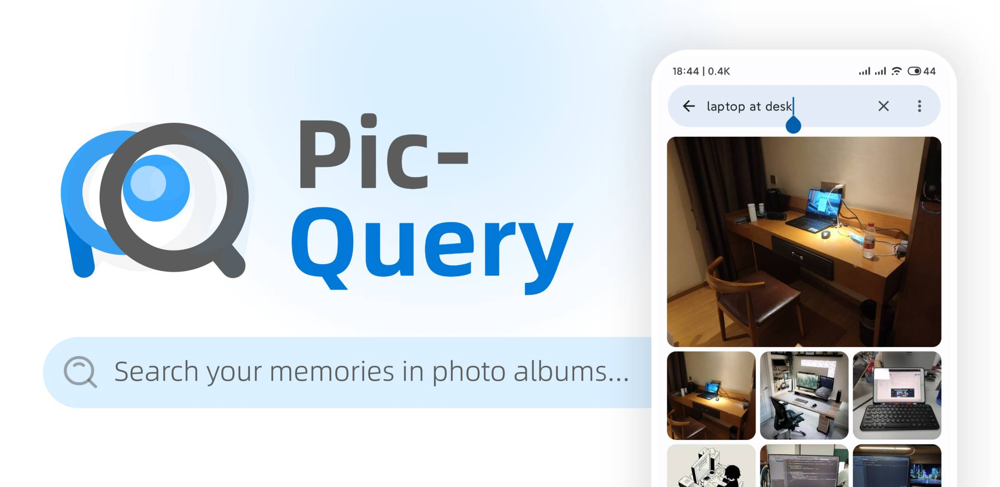

# PicQuery

English | [中文](README_zh.md)



Search local photos with English or Chinese descriptions, or use a photo as the query. PicQuery builds and searches a photo index on your device. It is free, with no in-app purchases.

This branch integrates Apple's **MobileCLIP2-S0 / dfndr2b** through two Android flavors: **ONNX Runtime** and **TFLite / LiteRT**. They can be installed together and keep separate indexes for comparing the same photos and queries.

[Google Play](https://play.google.com/store/apps/details?id=me.grey.picquery) · [Releases](https://github.com/greyovo/PicQuery/releases) · [Model guide](script/model-MobileCLIP2/README.md) · [Measurement reports](script/model-MobileCLIP2/results/README.md)

Published releases may use earlier models. Build this branch for the configuration below.

## Build and install

| Requirement | Version |
|---|---|
| JDK | 17 |
| Android SDK platform | 37 (`platforms;android-37.0`) |
| SDK tools | Current Android Studio or command-line tools 22+ |
| Android NDK | 29.0.14206865 |
| CMake | 3.22.1 |
| Android device | Android 10 / API 29 or newer |

Set your SDK location in Android Studio or `local.properties`. Use the included Gradle wrapper. The [version catalog](gradle/libs.versions.toml) pins the dependencies; the current inference runtimes are ONNX Runtime **1.29.0** and LiteRT **1.4.2**. Both flavors require NDK/CMake for the native delegate bridge.

### Prepare model assets

Model binaries are Git-ignored. Download the prebuilt App bundle from [Google Drive](https://drive.google.com/drive/folders/1eWHZ08c7TmVJU9ReQAe7z8o-EE9R297g?usp=sharing), then follow the [SHA-256 verification and installation steps](script/model-MobileCLIP2/downloads/README.md) to place the models in `app/src/main/assets/`. You can also [export the models](script/model-MobileCLIP2/README.md#reproduce-the-models). Retain the shared `bpe_vocab_gz` and bundled `mlkit/` assets.

| Flavor | Image asset | Text asset | Model pair size |
|---|---|---|---:|
| `onnx` | `mobileclip2_s0_image.onnx` | `mobileclip2_s0_text_int8.onnx` | 104.89 MiB |
| `tflite` | `image_model.tflite` | `text_model_dynamic_wi8.tflite` | 105.73 MiB |

Both flavors use **FP32 images and dynamic INT8 text weights**, with normalized FP32 embeddings. `text_model.tflite` is an offline FP32 reference and is excluded from the APK. Each flavor packages only its own model pair and shared assets; these sizes describe model files, not APK size or runtime memory.

```bash
./gradlew :app:assembleOnnxDebug :app:assembleTfliteDebug
adb -s DEVICE_SERIAL install -r app/build/outputs/apk/onnx/debug/app-onnx-debug.apk
adb -s DEVICE_SERIAL install -r app/build/outputs/apk/tflite/debug/app-tflite-debug.apk
```

On Windows, replace `./gradlew` with `.\gradlew.bat`. Replace `DEVICE_SERIAL` with the intended device's serial from `adb devices -l`.

| Launcher | Application ID |
|---|---|
| PicQuery MC2 ONNX | `me.grey.picquery.mobileclip2.onnx` |
| PicQuery MC2 TFLite | `me.grey.picquery.mobileclip2.tflite` |

Default APKs include ARM64 and ARMv7. For an x86_64 emulator, append `-Pmobileclip2Abis=x86_64` to the build command.

## Index and search

1. Open a flavor and grant photo access. Start with a small album, such as `Pictures/PicQuery-Demo`, created before opening the app.
2. Tap **Index → Add album**, select the intended album and check the photo count. Tap **Index**, wait for completion, then **Finish**.
3. Search for `dog`, `astronaut`, another description, or an image. To compare backends, index the same album in the other flavor.
4. To restrict an existing index, open **Range**, turn off **All albums**, select an album and tap **Finish**. The range resets when the app process restarts. Manage or delete indexes in **Settings → Album Index Manager**.

Only selected albums are encoded; startup enumerates accessible media metadata without automatically indexing every album. Restart if a newly added album is missing from the list.

ONNX uses **4 image / 4 text CPU threads**. TFLite uses native XNNPACK with **4 image / 2 text threads**. English queries still pass through translation; candidates that normalize to the same CLIP BPE text are encoded once.

## Measured results

The separate image-quantization experiment compares **FP32 image ORT** with **mixed INT8 image ORT**, both using the same dynamic INT8 text model. It does **not** compare the ONNX and TFLite flavors. On Pixel 8a / Tensor G3 / Android 17, ONNX Runtime 1.29.0, CPU 4 threads:

| Measurement | FP32 image | Mixed INT8 image |
|---|---:|---:|
| CIFAR-100 Top1, 2,000 test images | 74.60% | 73.90% |
| Imagenette Top1, 3,925 validation images | 98.04% | 97.96% |
| Image encoding P50, separate short benchmark | 67.58 ms | 53.46 ms |
| Image ORT file | 43.54 MiB | 13.52 MiB |
| Image + text ORT files | 105.05 MiB | 75.03 MiB |

[Full phone accuracy and confidence intervals](script/model-MobileCLIP2/results/image-int8/pixel8a-accuracy/README.md) · [Quantization, size and timing protocol](script/model-MobileCLIP2/results/image-int8/README.md)

Accuracy used fixed English class prompts and phone-generated embeddings. Timing used preloaded inputs, two rounds of 100 calls after 10 warm-ups per tower, excluding photo decoding, resizing, tokenization and database search. It is not end-to-end search latency or sustained indexing performance.

The mixed candidate keeps sensitive convolutions in FP32. **ORT export and image quantization do not change the App's selected models**; the current flavors retain FP32 image inference. Adopting a different image encoder requires rebuilding its photo index.

## Checks and limitations

```bash
./gradlew :app:testOnnxDebugUnitTest :app:testTfliteDebugUnitTest \
  :app:ktlintCheck :app:lintOnnxDebug :app:lintTfliteDebug
```

See the [model guide](script/model-MobileCLIP2/README.md#run-on-android) for device tests using explicit `adb -s` installation and execution. The [ktlint baseline](app/config/ktlint/baseline.xml) records existing findings; do not regenerate it automatically to hide failures.

Submission evidence: [Android build and device validation](script/model-MobileCLIP2/results/submission/android-validation.json) · [Code and offline regression checks](script/model-MobileCLIP2/results/submission/code-validation.json). These checks do not constitute a new performance measurement.

- Recorded device validation uses Debug APKs on Pixel 8a with 4 KB memory pages. Release/R8, GPU/NPU, other phones and whole-APK 16 KB page compatibility remain unverified; a compatibility notice appeared on the tested device.
- Class-label benchmarks and a small demo album do not establish quality for personal galleries, free-form descriptions, Chinese translation or OCR.
- Host and phone results use different CPU kernels. Historical runs also use different runtime versions and protocols; compare them only within their documented scope. The [report index](script/model-MobileCLIP2/results/README.md) separates these experiments.

## Historical models

Earlier CLIP and MobileCLIP modules remain as development references. The original App's MobileCLIP `vision_model.ort` / `text_model.ort` pair was unavailable, so v1 S0/S2 evaluation uses official checkpoint re-exports rather than the unidentified original binaries. See [historical model resources](script/model-MobileCLIP2/README.md#historical-models) for downloads and evaluation boundaries.

## Contributing and acknowledgments

Issues and pull requests are welcome. Include reproduction steps, the flavor, runtime/model versions and relevant checks; model or preprocessing changes should include numerical and retrieval validation.

PicQuery builds on OpenAI [CLIP](https://github.com/openai/CLIP) and Apple [MobileCLIP](https://github.com/apple-aiml-research/ml-mobileclip). Thanks to [@mazzzystar](https://github.com/mazzzystar) and [@Young-Flash](https://github.com/Young-Flash) for their help; see the [original discussion](https://github.com/mazzzystar/Queryable/issues/12).

- [mazzzystar/Queryable](https://github.com/mazzzystar/Queryable), the inspiration for this project, with an [iOS app](https://apps.apple.com/us/app/queryable-find-photo-by-text/id1661598353).
- [IacobIonut01/Gallery](https://github.com/IacobIonut01/Gallery).

## License

This project is open-source under the [MIT license](LICENSE). All rights reserved. Model assets retain their original terms; see the [Apple model license](https://github.com/apple-aiml-research/ml-mobileclip/blob/main/LICENSE_MODELS).
