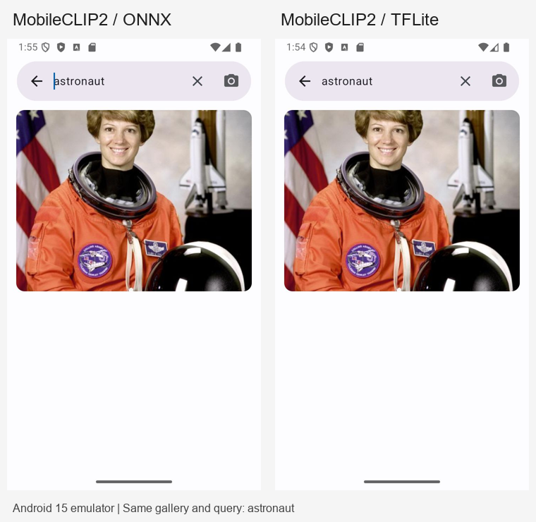

# MobileCLIP2-S0 集成与验证

后续已补充 [v1 / v2 有标签识别精度对比](识别精度对比.md)，使用 5,925 张图片。
下文五图实验用于转换一致性和运行链路检查；识别准确率请看该独立报告。

日期：2026-09-13。模型为官方 `MobileCLIP2-S0 / dfndr2b`。

沿用修改前 `modulesTF` 实际运行的精度：**图像 FP32，文本动态 INT8 权重**。没有将全精度文本模型装入 APK，也没有将两套后端模型一起打包。两版均使用 CPU 4 线程，独立应用 ID 和索引。

## 安装与试用

| 版本 | ARM 手机安装包 | APK 大小 | 模型合计 |
|---|---|---:|---:|
| ONNX | [app-onnx-debug.apk](../../../app/build/outputs/apk/onnx/debug/app-onnx-debug.apk) | 284.12 MB | 109.98 MB |
| TFLite | [app-tflite-debug.apk](../../../app/build/outputs/apk/tflite/debug/app-tflite-debug.apk) | 285.01 MB | 110.86 MB |

APK 位于仓库根目录的 `app/build/outputs/apk/{onnx,tflite}/debug/`。支持 Android 10+，包含 `arm64-v8a` 和 `armeabi-v7a`；包名分别为 `me.grey.picquery.mobileclip2.onnx` 和 `me.grey.picquery.mobileclip2.tflite`。模型之外的体积来自现有翻译资源和运行库等。SHA-256 及打包模型清单见 [apk-manifest.json](apk-manifest.json)。

安装后，在两版中分别索引同一相册，使用相同描述、搜索范围和匹配阈值比较。设置页标明当前后端和精度。英文查询可以排除中文翻译造成的差异。

## 实际效果

Android 15 模拟器中，两版均完成样例相册索引，查询 `astronaut` 均返回宇航员照片：

主机使用 5 张图片、13 条查询，四线程、3 次预热、每输入重复 5 次：

| 测量项 | ONNX | TFLite |
|---|---:|---:|
| 图像推理中位数 | 13.53 ms | 20.39 ms |
| INT8 文本推理中位数 | 7.57 ms | 7.60 ms |
| 文本与 FP32 参考的最低余弦 | 0.92782 | 0.99924 |

两版图像向量余弦约为 1；13 条文字搜图查询中，12 条首位结果相同。不一致的是 `a plate of food`，测试相册没有食物图片。ONNX 标准动态量化的文本误差明显大于现有 TFLite。这组数据只能用于转换和检索试跑，不能当作正式检索准确率；耗时是主机测量，且当时有开发构建负载，不能当作手机速度。

完整排序、相似度、环境及输入哈希见 [主机报告](host-comparison.md) 和 [原始 JSON](host-comparison.json)。

## 验证结果

- 两个 ARM Debug APK 构建成功；逐个检查打包资产的 SHA-256，确认只有各自图像及 INT8 文本模型，且无 x86 库混入手机包。
- 两版各 12 项已有单元测试通过，共 24 次执行。
- 两版 Android Lint 均为 0 个错误；现有 95 个警告仍保留。ktlint 通过；Detekt 已执行且没有新增 MobileCLIP2 运行时代码问题，仓库原有复杂度和命名等警告仍保留。
- 两版在 x86_64 Android 15 模拟器通过新增的真实模型 Instrumentation 测试：实际资产哈希、官方 BPE token、有限的 512 维单位向量、重复推理、三图批次顺序、不同输入和关闭后拒绝推理。
- 测试中图像与官方参考余弦均大于 0.99999。文本与对应量化主机输出的余弦为 ONNX 0.99833、TFLite 0.99956；量化内核与运行时版本差异不应按 FP32 近乎完全一致的条件判断。测试使用 0.995 跨运行时门槛，另保留官方 dog 参考的 ONNX 0.98 / TFLite 0.999 门槛。

设备原始结果：[ONNX](emulator-onnx.json)、[TFLite](emulator-tflite.json)。最终通过记录在本机 `build/mobileclip2-{onnx,tflite}-instrumentation.log`，均为 `OK (1 test)`。首次过严门槛失败的旧 Gradle 结果仍在构建目录中，以最终手动调用同一 AndroidJUnitRunner 的记录为准。

尚未测量真实 ARM 手机的速度、峰值内存、发热和大型个人相册召回。模拟器使用原生 x86_64 测试包；ARM 兼容层加载原有翻译库时出现 AES 指令问题，不能据此判断真机行为。

## 主要改动

- `feature/mobileclip2/`：替换原来不完整的混合模型接入，统一成对后端、预处理、会话生命周期和输出校验；共享预处理从拉伸正方形改为等比缩放后中心裁剪。
- `app/build.gradle.kts`、`AppModules.kt`、Manifest、设置页及字符串：增加两种构建变体、独立安装和按需打包，支持 `-Pmobileclip2Abis=x86_64` 测试。
- `script/model-MobileCLIP2/`：新增 ONNX 导出与量化、主机对比、参考样本生成和带哈希的测量结果。Android 未增加依赖；缺少的 Python ONNX 包仅装入本机忽略目录。
- `androidTest/`：新增实际模型验证及独立参考样本。
- 修复阻碍 Lint 的四处旧问题：两个 Compose locale 读取、搜索筛选的 StateFlow 订阅、缺失的中文错误提示；删除不必要的列表复制。

复现步骤见 [模型说明](../README.md)。本机 Windows 若遇到 Java `Unable to establish loopback connection`，可先创建 `build/java-tmp`，为当前终端将 `TEMP`、`TMP` 和 `JAVA_TOOL_OPTIONS=-Djava.io.tmpdir=...` 指向这个完整路径，再运行 Gradle。本次使用已安装的 JDK 17。
